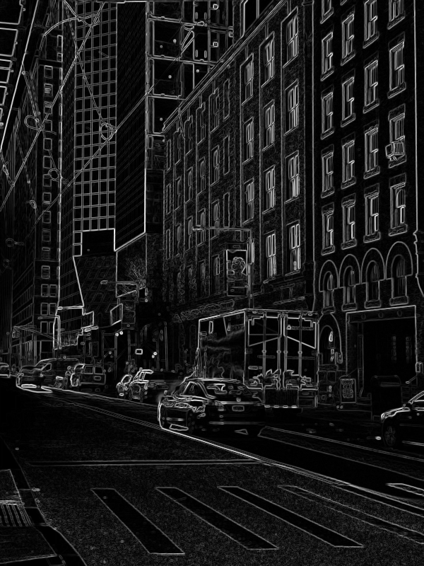
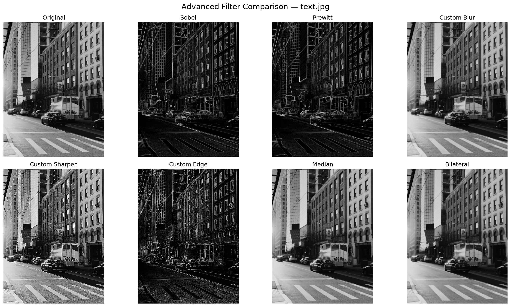

# Bài Tập Xử Lý Ảnh Nâng Cao — Đánh giá — Demo — Kết luận

*Nhóm 5 — Image Processing Lab 02: Point Operations & Linear Filters*

---

## 1. Phát hiện cạnh (Edge Detection) — Sobel & Prewitt

**Ý tưởng:** cạnh trong ảnh là nơi độ sáng thay đổi đột ngột. Ta tính đạo hàm xấp xỉ của ảnh theo hai hướng X (ngang) và Y (dọc) bằng cách nhân chập (convolution) ảnh với một cặp kernel 3×3, rồi kết hợp lại thành "độ lớn gradient".

**Kernel Sobel:**
```
Sobel X = [-1  0  1]      Sobel Y = [-1 -2 -1]
          [-2  0  2]                [ 0  0  0]
          [-1  0  1]                [ 1  2  1]
```
Trọng số ở hàng/cột giữa lớn hơn (2 thay vì 1) → nhạy hơn với vùng thay đổi mạnh, cạnh mượt hơn.

**Kernel Prewitt:**
```
Prewitt X = [-1  0  1]     Prewitt Y = [-1 -1 -1]
            [-1  0  1]                 [ 0  0  0]
            [-1  0  1]                 [ 1  1  1]
```
Trọng số đều nhau ở cả 3 hàng → đơn giản hơn Sobel, ít nhạy nhiễu hơn một chút.

**Code chính (rút gọn từ `edge_detection.py`):**
```python
def calculate_gradient_magnitude(gradient_x, gradient_y):
    # G = sqrt(Gx^2 + Gy^2)
    return np.sqrt(gradient_x ** 2 + gradient_y ** 2)

def sobel_edge_detection(image):
    gray = to_grayscale(image)
    sobel_x, sobel_y = create_sobel_kernels()
    gradient_x = apply_kernel(gray, sobel_x)   # tích chập theo X
    gradient_y = apply_kernel(gray, sobel_y)   # tích chập theo Y
    magnitude = calculate_gradient_magnitude(gradient_x, gradient_y)
    edge_image = normalize_image(magnitude)    # đưa về [0, 255]
    return edge_image, gradient_x, gradient_y
```
Phép tích chập (`apply_kernel`) tự cài bằng vòng lặp qua từng pixel: cắt vùng ảnh 3×3 quanh pixel đó, nhân từng phần tử với kernel rồi cộng lại (padding kiểu "edge" ở biên ảnh để không mất dữ liệu).

---

## 2. Tự thiết kế Custom Kernel

Ngoài các kernel có sẵn, nhóm tự định nghĩa 3 kernel mẫu và áp dụng bằng cùng cơ chế tích chập:

```python
def blur_kernel():      # làm mờ — lấy trung bình 3x3
    return np.array([[1,1,1],[1,1,1],[1,1,1]], dtype=np.float64) / 9

def sharpen_kernel():   # làm sắc nét
    return np.array([[0,-1,0],[-1,5,-1],[0,-1,0]], dtype=np.float64)

def edge_kernel():      # phát hiện cạnh kiểu Laplacian
    return np.array([[-1,-1,-1],[-1,8,-1],[-1,-1,-1]], dtype=np.float64)
```
Quy trình: **Ảnh đầu vào → chọn/thiết kế kernel → tích chập (`apply_custom_kernel`) → clip giá trị về [0,255] → ảnh kết quả.**

---

## 3. Bộ lọc phi tuyến (Nonlinear Filter) — Median & Bilateral

**Median Filter:** thay giá trị mỗi pixel bằng **giá trị trung vị** (không phải trung bình) của vùng lân cận. Rất hiệu quả để khử nhiễu dạng "muối tiêu" (salt-and-pepper) mà không làm mờ cạnh nhiều như Mean Filter.

```python
def median_filter_gray(image, kernel_size=3):
    ...
    for i in range(height):
        for j in range(width):
            region = padded_image[i:i+kernel_size, j:j+kernel_size]
            result[i, j] = np.median(region)   # lấy trung vị thay vì trung bình
    return result
```

**Bilateral Filter:** làm mờ ảnh nhưng vẫn **giữ được cạnh sắc nét**, nhờ kết hợp 2 loại trọng số:
- **Spatial weight**: dựa trên khoảng cách không gian (Gaussian theo tọa độ).
- **Range weight**: dựa trên độ chênh lệch cường độ pixel (Gaussian theo hiệu màu).

```python
spatial_weight = np.exp(-(X**2 + Y**2) / (2 * sigma_space**2))
...
intensity_difference = region - center
range_weight = np.exp(-(intensity_difference**2) / (2 * sigma_color**2))
weights = spatial_weight * range_weight
result[i, j] = np.sum(weights * region) / np.sum(weights)
```
Hai pixel gần nhau về vị trí nhưng khác biệt lớn về màu (tức đang ở hai bên một cạnh) sẽ có trọng số thấp → không bị trộn lẫn → cạnh được giữ nguyên.

---

## 4. Đánh giá — So sánh kết quả

Nhóm dùng `demo_advanced.py` chạy toàn bộ 7 kỹ thuật trên cùng một ảnh đầu vào, đo thời gian chạy và tính mean/std của từng ảnh kết quả:

| Phương pháp | Loại | Thời gian (s) | Mean pixel | Std pixel | Ghi chú |
|---|---|---|---|---|---|
| Sobel | Edge | 6.35 | 26.62 | 35.50 | Phát hiện cạnh bằng gradient X/Y |
| Prewitt | Edge | 6.20 | 26.40 | 35.23 | Phát hiện cạnh bằng gradient X/Y |
| Custom Blur | Custom Kernel | 3.33 | 107.48 | 62.45 | Kernel mean 3×3 |
| Custom Sharpen | Custom Kernel | 3.15 | 110.49 | 78.80 | Kernel làm sắc nét |
| Custom Edge | Custom Kernel | 3.43 | 31.28 | 59.47 | Kernel dạng Laplacian |
| Median | Nonlinear | 16.77 | 108.26 | 64.13 | Giảm nhiễu bằng trung vị |
| Bilateral | Nonlinear | 10.43 | 107.51 | 62.85 | Giảm nhiễu, giữ biên |

**Nhận xét chính:**
- **Median chạy chậm nhất** (~17s) vì phải sắp xếp giá trị trong từng cửa sổ pixel; Sobel/Prewitt mất ~6s mỗi cái do tích chập 2 lần (X và Y).
- **Custom Sharpen có độ lệch chuẩn cao nhất** (~79) → ảnh có độ tương phản mạnh nhất sau khi làm sắc nét.
- Sobel và Prewitt cho kết quả rất giống nhau về mặt số liệu (mean/std gần bằng nhau), đúng như lý thuyết vì cùng nguyên lý gradient.
- Bilateral và Median có mean/std gần nhau, nhưng Bilateral giữ cạnh tốt hơn nhờ cơ chế 2 trọng số.

### Ảnh minh họa

**Ảnh gốc (grayscale):**


**Sobel — làm nổi bật cạnh:**


**Median Filter — khử nhiễu, giữ chi tiết:**


**Bilateral Filter — làm mờ nhưng giữ cạnh:**


**Bảng tổng hợp 8 ảnh so sánh (Original + 7 kỹ thuật):**


---

## 5. Kết luận

- Project đi từ các phép toán điểm ảnh cơ bản (brightness, contrast, negative, threshold) → bộ lọc tuyến tính (Mean, Gaussian) → kỹ thuật nâng cao (Edge Detection, Custom Kernel, bộ lọc phi tuyến).
- **Không có phương pháp nào tốt nhất tuyệt đối** — mỗi kỹ thuật phù hợp một mục đích:
  - Cần tìm biên/contour → Sobel, Prewitt.
  - Cần hiệu ứng tùy biến → Custom Kernel.
  - Cần khử nhiễu mạnh, giữ chi tiết → Median.
  - Cần khử nhiễu mà vẫn giữ cạnh sắc nét → Bilateral.
- Việc chọn bộ lọc phụ thuộc vào **đặc điểm ảnh đầu vào** (nhiều nhiễu hay ít, cần giữ cạnh hay không) và **mục tiêu xử lý** cuối cùng.

---

